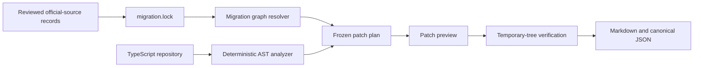

# Migration Doctor for OpenAI APIs

> Deterministic detection, source-grounded planning, scoped transformation, and behavioral verification for OpenAI API migrations.

**Project status:** pre-alpha. Local source builds support one deterministic TypeScript model-snapshot migration end to end, review-only Assistants API analysis, and offline before/after behavioral contract verification. The package is not published, Assistants transformation is not implemented, and repository runtime or live-API parity is not evaluated.

Migration Doctor is an **unofficial developer tool intended for open-source release** after license and provenance review. It is not an OpenAI product and is not affiliated with or endorsed by OpenAI.

## Why this exists

OpenAI publishes deprecation timelines and migration guides for models, APIs, and developer products. A production migration is still harder than replacing one string with another:

- a recommended destination can later acquire its own shutdown date;
- SDK calls can be wrapped, aliased, or selected dynamically;
- moving from Assistants to Responses and Conversations changes state and orchestration responsibilities;
- streaming, tools, file search, retries, and persistence create behavioral risk;
- a patch can compile and still change what users experience.

Migration Doctor answers four questions:

1. **What will break, where, and when?**
2. **Which migration path is supported by current official sources?**
3. **Which changes are safe to automate?**
4. **How do we prove that behavior was preserved?**

The current `migration.lock` pins:

- [OpenAI API deprecations](https://developers.openai.com/api/docs/deprecations)
- [GPT-4o mini Transcribe model](https://developers.openai.com/api/docs/models/gpt-4o-mini-transcribe)
- [Assistants migration guide](https://developers.openai.com/api/docs/assistants/migration)
- [Migrate from prompt objects](https://developers.openai.com/api/docs/guides/prompting/migrate-from-prompt-object)

Agent Builder, Codex, and skill documentation remain planned source families, not current rule coverage.

Official documentation changes over time. Migration Doctor versions reviewed source records and content hashes; it does not vendor the raw documentation pages. It never silently resolves a source disagreement. If two current sources imply incompatible destinations, the finding is routed to human review.

## Product thesis

> Static analysis should find evidence. Official sources should constrain the plan. Codex should handle semantic edits. Tests should decide whether the migration is acceptable.

Migration Doctor does not use an LLM to scan a repository. Detection is local and deterministic. Planned Codex remediation will be opt-in and will run only after the tool has produced a scoped, source-backed migration plan.

## Local quickstart

```bash
corepack pnpm install --frozen-lockfile
corepack pnpm build
corepack pnpm run doctor scan fixtures/typescript/direct-model-literal
corepack pnpm run doctor plan fixtures/typescript/direct-model-literal
corepack pnpm run doctor migrate fixtures/typescript/direct-model-literal --risk safe
corepack pnpm run doctor verify fixtures/typescript/direct-model-literal
corepack pnpm run doctor scan fixtures/typescript/assistants-direct
corepack pnpm run doctor verify-behavior \
  fixtures/behavior/assistants-to-responses/contract.json \
  fixtures/behavior/assistants-to-responses/baseline.json \
  fixtures/behavior/assistants-to-responses/candidate-compatible.json
```

Use `--format json` for canonical machine output. Execution duration and cache state are written to
stderr so JSON remains byte-stable for the same command inputs and source lock.

Locked source-registry artifacts and offline behavior fixtures remain on their independent schema
`1.0.0`. Findings and command reports, including behavior reports, use schema `3.0.0`; these
versions are independent so report-contract changes do not rewrite reviewed source evidence or
fixture inputs.

### `scan`

Indexes supported TypeScript files and reports exact evidence without calling an external API or changing the repository.

### `plan`

Combines findings with the locked migration graph and freezes exact edit offsets or source-backed manual actions, source hashes, and verification contracts.

### `migrate`

Produces a deterministic patch preview. A blocked plan produces an empty preview with its abstention reasons instead of applying a partial migration. This pre-alpha release never applies the patch to the source repository.

### `verify`

For a deterministic edit, applies the preview in a temporary tree and verifies the changed-file allowlist, exact literal edit, finding removal, and source-tree immutability. For a blocked analysis-only plan, records unresolved manual work and proves that no automatic transformation occurred. It does not yet run repository-specific tests or behavioral evaluation corpora.

### `verify-behavior`

Compares versioned baseline and candidate observations against an offline behavioral contract. The six fixed checks cover text output shape, normalized conversation state, streaming sequence, tool call sequence and arguments, error and retry behavior, and changed-file allowlists. It reads JSON fixtures only, performs no repository execution or network call, and reports that limited evidence scope explicitly.

### Exit codes

- `0`: no blocking finding, deterministic verification passed, or an offline behavioral contract passed;
- `1`: command completed and blocking migration findings remain;
- `2`: invalid invocation or configuration;
- `3`: analysis was incomplete;
- `4`: `migration.lock` or a locked artifact is missing or invalid, or the relevant graph is conflicted or cyclic;
- `5`: patch planning, deterministic verification, or behavioral contract verification failed.

## Current rule coverage

| Rule | Scope | Tier | Verification |
| --- | --- | --- | --- |
| `gpt-4o-mini-transcribe-2025-03-20` to `gpt-4o-mini-transcribe-2025-12-15` | Direct string literal in a recognized OpenAI TypeScript `audio.transcriptions.create` call | A | Exact edit and file-boundary contracts; runtime transcript parity not verified |
| `openai.assistants.api.assistants` | Reviewed direct or statically aliased TypeScript Assistants methods | C | Manual action; no automatic transformation; original tree unchanged |
| `openai.assistants.api.threads` | Reviewed Thread, Message, composite Thread/Run, and nested Run methods | C | Manual action; no automatic transformation; original tree unchanged |
| `openai.assistants.api.runs` | Reviewed composite Thread/Run, Run, and Run Step methods | C | Manual action; no automatic transformation; original tree unchanged |
| `openai.assistants.feature.*` | Streaming, tools, file search, and code interpreter facets bound to a confirmed deprecated call | C | Manual action; runtime semantics unverified |

The model rule intentionally keeps its narrow direct-call boundary. Assistants rules support selected static aliases and route high-signal wrappers, detached methods, computed access, indirect invocation, and dynamic facets to explicit abstentions. See the public [Assistants feature and pattern matrix](docs/assistants-rule-matrix.md) and [limitations](docs/limitations.md).

## Architecture



Codex remediation, Python, SARIF, HTML, and caching remain planned. The implemented dependency direction is documented in [architecture](docs/architecture.md).

### 1. Versioned migration graph

Every migration edge records:

- source model, API, SDK surface, or product;
- recommended destination;
- announcement and shutdown dates;
- official source URL and retrieval time;
- affected SDK versions and language constraints;
- expected behavioral changes;
- whether the destination is also deprecated;
- confidence and required review level.

A generated `migration.lock` pins the checked-in source and migration artifact hashes used for a run. Each source record also stores the SHA-256 of the official raw Markdown reviewed at retrieval time. Raw page bodies are not vendored, so the lock reproduces analyzer inputs rather than an offline copy of upstream documentation; see [methodology](docs/methodology.md) for the audit procedure.

The resolver follows same-language edges until it reaches a destination that is not itself deprecated. Multiple sources that name the same destination are aggregated; conflicting destinations, cycles, missing destinations, and SDK constraints without structured repository evidence produce deterministic review records. A relevant source conflict becomes a Tier C finding and no replacement is selected.

### 2. Deterministic repository analysis

The analyzer is responsible for evidence, not prose. It currently confirms one model literal rule and seven atomic Assistants feature classes from reviewed TypeScript call shapes. Findings include a stable rule ID, exact location, minimized evidence, source-backed graph path, confidence, automation tier, feature, pattern, disposition, and stable abstention code. SDK version inference, reusable Prompt detection, cross-file data flow, configuration files, and environment-based references remain future work.

### 3. Risk-tiered transformation

| Tier | Meaning | Default behavior |
| --- | --- | --- |
| **A: deterministic** | The transformation is syntax-local and the official mapping is unambiguous. | Patch preview; auto-apply only when requested. |
| **B: Codex-assisted** | The migration changes state, orchestration, or multiple files. | Source-backed plan, constrained Codex patch, mandatory verification. |
| **C: plan only** | Behavior cannot be established automatically or sources require interpretation. | No code change; emit an actionable plan and abstention reason. |

No tier may auto-merge or bypass repository tests.

### 4. Behavioral verification

Compilation is necessary but insufficient. Deterministic patch verification proves patch mechanics. The offline behavioral verifier separately compares declared before/after observations for:

- structured-output compatibility;
- tool name, argument, and sequence checks;
- conversation-state preservation;
- streaming-event ordering;
- error and retry behavior;
- changed-file allowlists.

The offline fixture result is not evidence that a repository produced those observations. Repository test discovery, runtime instrumentation, live API smoke tests, timeout behavior, and token, latency, and cost comparison remain future work.

Text output values and stream payload values are compared by JSON shape. Conversation identity,
linkage, order, and normalized metadata, tool calls and arguments, and retry attempts are compared
exactly. Reports contain mismatch paths and input hashes, not primitive output or stream values.

> Codex proposes. Tests decide.

## Coverage roadmap

| Area | Target level |
| --- | --- |
| TypeScript | Direct Transcriptions snapshot migration plus constrained Assistants analysis implemented |
| JavaScript | Planned |
| Python | Analyze, transform, and verify |
| Deprecated model IDs | Deterministic migration when compatibility is established |
| Assistants to Responses + Conversations | Feature-level analysis and offline behavioral contracts implemented; transformation planned |
| Streaming and function calling | Assistants-bound detection implemented; transformation planned |
| Reusable prompt objects | Migration to application-managed configuration |
| File search and code interpreter | Assistants-bound literal detection implemented; transform only with proven contracts |
| Agent Builder and Evals | Evidence-backed plan; no speculative rewrite |
| Custom agent frameworks | Detect known OpenAI surfaces and abstain on unknown orchestration |

Coverage is published per rule. A broad claim such as “supports Assistants migration” is not allowed without a feature-level matrix.

## Example finding

```json
{
  "schemaVersion": "3.0.0",
  "id": "206aba3c539f65ed2bd4cb216e800722918d5bd76c2c67f75c4251df0a1738f3",
  "kind": "deprecated-usage",
  "language": "typescript",
  "resource": {
    "kind": "model",
    "id": "gpt-4o-mini-transcribe-2025-03-20"
  },
  "ruleId": "openai.transcriptions.model.gpt-4o-mini-transcribe-2025-03-20",
  "severity": "error",
  "location": {
    "file": "src/transcribe.ts",
    "line": 11,
    "column": 13,
    "startOffset": 355,
    "endOffset": 388
  },
  "fileHash": "276e9080d44d2a1ebd841dcfaf69af693e01705ff453286840a24d19c78c8fb3",
  "evidence": "gpt-4o-mini-transcribe-2025-03-20",
  "migrationEdgeIds": [
    "openai.model.gpt-4o-mini-transcribe-2025-03-20.to.2025-12-15"
  ],
  "graphIssueIds": [],
  "confidence": "high",
  "automationTier": "A",
  "reviewRequired": true,
  "analysis": {
    "family": "model-snapshot",
    "feature": "model-snapshot",
    "pattern": "direct",
    "disposition": "supported"
  },
  "remediation": {
    "kind": "replace-string-literal",
    "replacement": "gpt-4o-mini-transcribe-2025-12-15"
  }
}
```

The report also records exact offsets and the original file hash so a stale plan fails closed.

## Quality targets

These are release gates, not current results:

- at least **99% precision** on the labeled benchmark corpus;
- at least **95% recall** on supported patterns;
- **100% source provenance** for migration guidance;
- **zero unverified auto-applies**;
- deterministic output for the same repository and source lock;
- formatting and comments preserved by supported codemods;
- explicit abstention for unsupported cases;
- SDK version-matrix tests on macOS and Linux;
- secret and transcript redaction in every reporter.

LLM judgment alone cannot mark a migration as verified.

## Performance targets

Targets must be published with hardware, OS, repository composition, and tool version:

- one million lines of code scanned in **30 seconds or less** from a cold cache;
- incremental scan completed in **3 seconds or less** from a warm cache;
- **zero API calls** during detection;
- content-hash caching for unchanged files;
- parallel analysis of independent files;
- Codex invoked only for findings that require semantic remediation;
- latency, peak memory, token usage, and API cost reported together.

The benchmark suite will treat performance regressions as release blockers.

## Security and privacy

- Local analysis is the default.
- Detection never requires an OpenAI API key.
- No current command sends source files to a model.
- Codex remediation is not implemented yet; its future contract requires explicit opt-in and the smallest sufficient scope.
- Verification uses a temporary repository copy.
- Full-access execution is not part of the supported workflow.
- Secrets, environment values, raw transcripts, and customer code are excluded from public reports.
- No patch is pushed, opened as a pull request, deployed, or merged without explicit user action.

## Evaluation

The current deterministic suite contains 12 TypeScript fixture classes, five checked-in synthetic
graph fixtures, nine offline behavior fixtures, and 95 automated tests. It covers schema
invariants, byte-exact source locks, graph traversal and conflicts, constrained-path abstention,
model and Assistants analysis, symbol identity and alias boundaries, stable unsupported-pattern
routing, stale plans, locale-independent canonical reports, atomic abstention, patch preview,
temporary-tree verification, isolated behavioral regressions, report redaction, and CLI exit codes.

On the authored Phase 3 corpus, supported detection measures 19 true positives, 0 false positives, and 0 false negatives: 100% precision and 100% recall. All 13 labeled high-signal abstentions route exactly, and a separate 34-call method matrix produces the expected 58 atomic feature findings. These are synthetic implementation results, not a public benchmark or a claim about arbitrary repositories.

The public benchmark will include:

- at least 100 labeled TypeScript and Python fixtures;
- supported OpenAI SDK version combinations;
- positive and negative controls;
- aliases, wrappers, dynamic configuration, comments, and dead code;
- streaming, tools, and conversation state;
- ambiguous cases that must abstain;
- replacement targets that are themselves scheduled for shutdown;
- source disagreement requiring human review.

The benchmark reports precision, recall, false-positive classes, transformation success, behavioral parity, abstention quality, latency, memory, and cost.

## Outputs

Implemented now:

- terminal Markdown;
- canonical JSON;
- exact file and line findings;
- source-backed patch plans;
- source-backed manual migration actions;
- patch previews;
- deterministic verification ledgers;
- offline behavioral contract reports with canonical input hashes and path-only mismatch evidence.

Planned after the core stabilizes:

- `migration-report.md`;
- `migration-report.json`;
- SARIF for code-host annotations;
- a static HTML report;
- a scoped patch and verification ledger;
- an optional pull-request summary;
- a product-feedback memo that separates documentation friction from tool limitations.

## Implemented repository structure

```text
migration-doctor/
├── packages/
│   ├── core/
│   ├── cli/
│   ├── language-typescript/
│   └── reporters/
├── data/
│   ├── sources/
│   └── migrations/
├── fixtures/
│   ├── behavior/
│   ├── graph/
│   └── typescript/
├── docs/
│   ├── architecture.md
│   ├── assistants-rule-matrix.md
│   ├── methodology.md
│   ├── safety.md
│   └── limitations.md
├── tests/
├── AGENTS.md
├── migration.lock
└── README.md
```

## Development sequence

The project is quality-gated rather than date-gated:

1. **Done:** establish schemas, source provenance, and a TypeScript vertical slice.
2. **Done:** prove graph traversal, destination-deprecation checks, conflict records, and Tier C abstention.
3. **Done:** add Assistants analysis and useful unsupported-pattern abstention without transformation.
4. **Done:** define offline application behavioral contracts and prove precise failures against deliberately broken observations.
5. **Current:** add isolated Codex remediation that is constrained by the frozen plan and the same contracts.
6. Publish the benchmark and performance ledger.
7. Add Python through the same language-adapter contract.
8. Package the validated workflow as a Codex skill, then as a plugin if broader distribution is justified.

Each step must improve the evidence base; feature count alone is not progress.

## Non-goals

- a general-purpose dependency updater;
- a chat wrapper around migration documentation;
- speculative rewriting of arbitrary agent frameworks;
- automatic merging or deployment;
- a hosted service that uploads private repositories;
- claims of full migration coverage without a public rule matrix;
- an official benchmark of OpenAI models or products.

## Contributing

The contribution model will be defined after the first vertical slice. Every migration rule will require:

1. an official source;
2. positive and negative fixtures;
3. a declared automation tier;
4. a verification contract;
5. benchmark coverage;
6. a documented abstention boundary.

## License

License selection is pending. Do not copy external fixtures or code into the repository until a compatible project license and provenance policy are established.
