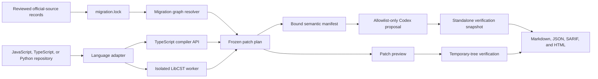

# Migration Doctor for OpenAI APIs

> Deterministic detection, source-grounded planning, scoped transformation, and behavioral verification for OpenAI API migrations.

**Project status:** [`0.1.0-alpha.1`](https://github.com/sujileelea/openai-migration-doctor/releases/tag/v0.1.0-alpha.1). Local source builds support one deterministic JavaScript,
TypeScript, and Python model-snapshot migration end to end; review-only Assistants API analysis in
all three languages; offline before/after behavioral contract verification; saved report bundles;
and an opt-in Codex remediation adapter boundary. No production rule or CLI command routes a plan
to Codex, Assistants transformation is not implemented, and live-API parity is not evaluated.

Migration Doctor is an **unofficial, publicly developed pre-alpha developer tool** licensed under
the Apache License, Version 2.0. It is not an OpenAI product and is not affiliated with or endorsed
by OpenAI. External material is governed by the repository's
[provenance policy](docs/provenance.md).

Start with the [five-minute quickstart](docs/quickstart.md), or inspect the sanitized
[sample report bundle](examples/sample-report/).

## Why this exists

OpenAI publishes deprecation timelines and migration guides for models, APIs, and developer products. A production migration is still harder than replacing one string with another:

- a recommended destination can later acquire its own shutdown date;
- SDK calls can be wrapped, aliased, or selected dynamically;
- moving from Assistants to Responses and Conversations changes state and orchestration responsibilities;
- streaming, tools, file search, retries, and persistence create behavioral risk;
- a patch can compile and still change what users experience.

Migration Doctor answers four questions:

1. **What will break, where, and when?**
2. **Which migration path is supported by current official sources?**
3. **Which changes are safe to automate?**
4. **How do we prove that behavior was preserved?**

The current `migration.lock` pins:

- [OpenAI API deprecations](https://developers.openai.com/api/docs/deprecations)
- [GPT-4o mini Transcribe model](https://developers.openai.com/api/docs/models/gpt-4o-mini-transcribe)
- [Assistants migration guide](https://developers.openai.com/api/docs/assistants/migration)
- [Migrate from prompt objects](https://developers.openai.com/api/docs/guides/prompting/migrate-from-prompt-object)

Agent Builder and Codex documentation are not current migration-rule source families. The
checked-in audit skill packages the implemented CLI workflow; it does not expand rule coverage.

Official documentation changes over time. Migration Doctor versions reviewed source records and content hashes; it does not vendor the raw documentation pages. It never silently resolves a source disagreement. If two current sources imply incompatible destinations, the finding is routed to human review.
The separate [source-drift gate](docs/source-drift.md) checks current official Markdown only on an
explicit scheduled or manual network path and never edits reviewed records automatically.

## Product thesis

> Static analysis should find evidence. Official sources should constrain the plan. Codex should handle semantic edits. Tests should decide whether the migration is acceptable.

Migration Doctor does not use an LLM to scan a repository. Detection is local and deterministic.
The optional `codex-adapter` can run only after a caller supplies a frozen, source-backed semantic
plan, the exact branded registry returned by `loadMigrationRegistry`, and declared offline
behavioral evidence. The loader validates every locked artifact hash, and the adapter reads a
schema-validated registry snapshot once and verifies its canonical integrity; the checked-in,
unsigned `migration.lock` remains the trust anchor. Before creating or running the separately
hashed manifest, the adapter exports the exact Git revision, re-scans it with its built-in
TypeScript adapter, and reproduces the plan byte for byte. The current locked rules do not produce a
Tier B plan, so normal CLI workflows never invoke Codex.

## Local quickstart

Prerequisites are Git, Node.js 20 or later, Corepack, Python 3.9 or later, and `curl`. Install the
exact supported `uv` release, then install both frozen dependency sets. The checked-in `uv.lock`
resolves the worker to exactly LibCST 1.9.0; `--locked` rejects dependency drift instead of
updating that lock.

```bash
git clone https://github.com/sujileelea/openai-migration-doctor.git
cd openai-migration-doctor

curl -LsSf https://astral.sh/uv/0.9.18/install.sh | sh
export PATH="$HOME/.local/bin:$PATH"
uv --version # must report uv 0.9.18

corepack pnpm install --frozen-lockfile
uv sync --project packages/language-python --locked
corepack pnpm python:lock:check
corepack pnpm build

REPORT_PARENT="$(mktemp -d)"
corepack pnpm run doctor report fixtures/typescript/direct-model-literal \
  --output "$REPORT_PARENT/typescript-report"
corepack pnpm run doctor report fixtures/python/direct-model-literal \
  --output "$REPORT_PARENT/python-report"

corepack pnpm run doctor plan fixtures/typescript/direct-model-literal
corepack pnpm run doctor migrate fixtures/typescript/direct-model-literal --risk safe
corepack pnpm run doctor verify fixtures/typescript/direct-model-literal
# Explicit repository execution is opt-in and accepts argv as JSON, never a shell string.
corepack pnpm run doctor verify-repository /path/to/repository \
  --command '["node","--test"]'
corepack pnpm run doctor scan fixtures/typescript/assistants-direct
corepack pnpm run doctor verify-behavior \
  fixtures/behavior/assistants-to-responses/contract.json \
  fixtures/behavior/assistants-to-responses/baseline.json \
  fixtures/behavior/assistants-to-responses/candidate-compatible.json
```

Each `report` output must be a new directory outside the scanned target. It contains
`migration-report.md`, `migration-report.json`, `migration-report.sarif`, and
`migration-report.html`. The command performs one scan and prints the selected format to stdout as
well; pass `--format json`, `sarif`, or `html` when needed. Both quickstart report targets contain
the deprecated literal, so each writes a complete bundle and then exits `1` as an expected finding
result.

Use `--format json` for canonical machine output. Execution duration and cache state are written to
stderr so JSON remains byte-stable for the same command inputs and source lock.

Locked source-registry artifacts and offline behavior fixtures remain on their independent schema
`1.0.0`. Findings and command reports, including behavior reports, use schema `4.0.0`. Semantic
plans and Codex adapter records each use a separate schema `1.0.0`. These lifecycles are independent
so changes to one contract do not silently rewrite another.

### `scan`

Indexes supported JavaScript, TypeScript, and Python files and reports exact evidence without calling an
external API or changing the repository.

### `report`

Runs the same read-only scan once and saves Markdown, canonical JSON, SARIF 2.1.0, and a script-free
static HTML view in a newly claimed external directory. It refuses an existing destination or any
output location inside the scanned repository and never replaces an existing report entry. A failed
or interrupted publication can leave a partial new directory for manual inspection.

### `plan`

Combines findings with the locked migration graph and freezes exact edit offsets or source-backed manual actions, source hashes, and verification contracts.

### `migrate`

Produces a deterministic patch preview. A blocked plan produces an empty preview with its abstention reasons instead of applying a partial migration. This pre-alpha release never applies the patch to the source repository.

### `verify`

For a deterministic edit, applies the preview in a temporary tree and verifies the changed-file allowlist, exact literal edit, finding removal, and source-tree immutability. For a blocked analysis-only plan, records unresolved manual work and proves that no automatic transformation occurred. It does not yet run repository-specific tests or behavioral evaluation corpora.

### `verify-repository`

First completes the unchanged deterministic `verify` path. Only after that path passes, it applies
the frozen preview to a second temporary copy and runs one to eight operator-supplied `--command`
JSON argv arrays in order, without shell parsing. Commands receive a minimal environment with a
private temporary home and a 120-second default timeout; only a small host environment allowlist is
inherited, and ambient credential variables are omitted.
Each command is trusted repository code: this boundary does not enforce filesystem or network
isolation. Dependencies excluded from the copy must be prepared by an explicit command.

The canonical JSON report contains argv hashes, status, exit code, and bounded output byte counts,
not argv or output bodies. Up to 8 KiB per output stream is path- and secret-pattern-redacted on
stderr, and a command is terminated after 1 MiB of aggregate output. After commands finish, the
scanner-visible candidate tree must still equal the patched tree; generated content under the
standard scanner exclusions is outside that hash. Passing arbitrary build or test commands does
not by itself prove migration behavior, so `runtimeBehaviorVerified` remains `false`. This command
is unavailable on Windows because descendant process containment is not guaranteed there. The
ordinary `verify` command never executes repository code.

### `verify-behavior`

Compares versioned baseline and candidate observations against an offline behavioral contract. The six fixed checks cover text output shape, normalized conversation state, streaming sequence, tool call sequence and arguments, error and retry behavior, and changed-file allowlists. It reads JSON fixtures only, performs no repository execution or network call, and reports that limited evidence scope explicitly.

### Exit codes

- `0`: no blocking finding, deterministic or explicit repository verification passed, or an offline behavioral contract passed;
- `1`: command completed and blocking migration findings remain;
- `2`: invalid invocation or configuration;
- `3`: analysis was incomplete;
- `4`: `migration.lock` or a locked artifact is missing or invalid, or the relevant graph is conflicted or cyclic;
- `5`: patch planning, deterministic, repository-command, or behavioral contract verification failed.

## Current rule coverage

| Rule | Scope | Tier | Verification |
| --- | --- | --- | --- |
| `gpt-4o-mini-transcribe-2025-03-20` to `gpt-4o-mini-transcribe-2025-12-15` | Direct string literal in a recognized OpenAI JavaScript or TypeScript `audio.transcriptions.create` call, using ESM or conservative CommonJS construction | A | Exact edit and file-boundary contracts; runtime transcript parity not verified |
| `gpt-4o-mini-transcribe-2025-03-20` to `gpt-4o-mini-transcribe-2025-12-15` | Exact `model=` string literal in a recognized Python `audio.transcriptions.create` call on a directly assigned `OpenAI` or `AsyncOpenAI` client | A | LibCST rewrite preserves formatting and comments; exact edit and file-boundary contracts; runtime transcript parity not verified |
| `openai.assistants.api.assistants` | Reviewed JavaScript, TypeScript, or Python Assistants methods rooted in a proven OpenAI client | C | Manual action; no automatic transformation; original tree unchanged |
| `openai.assistants.api.threads` | Reviewed Thread, Message, composite Thread/Run, and nested Run methods | C | Manual action; no automatic transformation; original tree unchanged |
| `openai.assistants.api.runs` | Reviewed composite Thread/Run, Run, and Run Step methods | C | Manual action; no automatic transformation; original tree unchanged |
| `openai.assistants.feature.*` | Streaming, tools, file search, and code interpreter facets bound to a confirmed deprecated call | C | Manual action; runtime semantics unverified |

The model rule intentionally keeps a narrow direct-call boundary. The compiler adapter scans
JavaScript and TypeScript ESM plus conservative CommonJS constructor patterns. The Python adapter
scans `.py` and `.pyi`, requires LibCST-proven imported constructors and one lexically preceding
visible direct client assignment, and conservatively skips a candidate beneath a local `openai.py` or
`openai/__init__.py`. Assistants analysis supports reviewed same-file bindings and routes proven
but unsupported TypeScript/JavaScript patterns and dynamic Python facets to explicit abstentions.
Cross-file clients and unproven provenance remain silent recall boundaries. See the public
[Assistants feature and pattern matrix](docs/assistants-rule-matrix.md) and
[limitations](docs/limitations.md).

## Architecture



The CLI composes all three language adapters with the same core pipeline and reporters. The removable
Codex adapter remains outside CLI dependency flow; no production Tier B rule routes to it. The
JavaScript and TypeScript adapters share a process-local content-hash cache, while Python uses an
isolated, sanitized LibCST subprocess. The implemented dependency direction is documented in
[architecture](docs/architecture.md).

### 1. Versioned migration graph

Every migration edge records:

- source model, API, SDK surface, or product;
- recommended destination;
- announcement and shutdown dates;
- official source URL and retrieval time;
- affected SDK versions and language constraints;
- expected behavioral changes;
- whether the destination is also deprecated;
- confidence and required review level.

A generated `migration.lock` pins the checked-in source and migration artifact hashes used for a run. Each source record also stores the SHA-256 of the official raw Markdown reviewed at retrieval time. Raw page bodies are not vendored, so the lock reproduces analyzer inputs rather than an offline copy of upstream documentation; see [methodology](docs/methodology.md) for the audit procedure.

The resolver follows same-language edges until it reaches a destination that is not itself deprecated. Multiple sources that name the same destination are aggregated; conflicting destinations, cycles, missing destinations, and SDK constraints without structured repository evidence produce deterministic review records. A relevant source conflict becomes a Tier C finding and no replacement is selected.

### 2. Deterministic repository analysis

The analyzers are responsible for evidence, not prose. They confirm one model literal rule in
JavaScript, TypeScript, and Python and seven atomic Assistants feature classes in reviewed call
shapes for those languages. Findings include a stable rule ID, exact location, minimized evidence, source-backed graph
path, confidence, automation tier, feature, pattern, disposition, and stable abstention code. SDK
version inference, reusable Prompt detection, cross-file data flow, configuration files, and
environment-based references remain future work.

### 3. Risk-tiered transformation

| Tier | Meaning | Default behavior |
| --- | --- | --- |
| **A: deterministic** | The transformation is syntax-local and the official mapping is unambiguous. | Patch preview and temporary-copy verification; no source-tree apply in pre-alpha. |
| **B: Codex-assisted** | The migration changes state, orchestration, or multiple files. | Source-backed plan, constrained Codex patch, mandatory verification. |
| **C: plan only** | Behavior cannot be established automatically or sources require interpretation. | No code change; emit an actionable plan and abstention reason. |

No tier may auto-merge or bypass repository tests.

### 4. Behavioral verification

Compilation is necessary but insufficient. Deterministic patch verification proves patch mechanics. The offline behavioral verifier separately compares declared before/after observations for:

- structured-output compatibility;
- tool name, argument, and sequence checks;
- conversation-state preservation;
- streaming-event ordering;
- error and retry behavior;
- changed-file allowlists.

The offline fixture result is not evidence that a repository produced those observations.
`verify-repository` can run explicitly configured commands after deterministic verification, but it
does not discover tests or classify a command as behavioral evidence. Runtime instrumentation,
live API smoke-test policy, and token, latency, and cost comparison remain future work.

Text output values and stream payload values are compared by JSON shape. Conversation identity,
linkage, order, and normalized metadata, tool calls and arguments, and retry attempts are compared
exactly. Reports contain mismatch paths and input hashes, not primitive output or stream values.

> Codex proposes. Tests decide.

## Coverage roadmap

| Area | Target level |
| --- | --- |
| TypeScript | Direct Transcriptions snapshot migration plus constrained Assistants analysis implemented |
| JavaScript | ESM and conservative CommonJS direct Transcriptions migration plus constrained Assistants analysis implemented |
| Python | Direct Transcriptions migration and constrained Assistants analysis implemented for `.py` and `.pyi` |
| Deprecated model IDs | Deterministic migration when compatibility is established |
| Assistants to Responses + Conversations | Feature-level analysis and offline behavioral contracts implemented; transformation planned |
| Streaming and function calling | Assistants-bound detection implemented; transformation planned |
| Reusable prompt objects | Migration to application-managed configuration |
| File search and code interpreter | Assistants-bound literal detection implemented; transform only with proven contracts |
| Agent Builder and Evals | Evidence-backed plan; no speculative rewrite |
| Custom agent frameworks | Detect known OpenAI surfaces and abstain on unknown orchestration |

Coverage is published per rule. A broad claim such as “supports Assistants migration” is not allowed without a feature-level matrix.

## Example finding

```json
{
  "schemaVersion": "4.0.0",
  "id": "206aba3c539f65ed2bd4cb216e800722918d5bd76c2c67f75c4251df0a1738f3",
  "kind": "deprecated-usage",
  "language": "typescript",
  "resource": {
    "kind": "model",
    "id": "gpt-4o-mini-transcribe-2025-03-20"
  },
  "ruleId": "openai.transcriptions.model.gpt-4o-mini-transcribe-2025-03-20",
  "severity": "error",
  "location": {
    "file": "src/transcribe.ts",
    "line": 11,
    "column": 13,
    "startOffset": 355,
    "endOffset": 388
  },
  "fileHash": "276e9080d44d2a1ebd841dcfaf69af693e01705ff453286840a24d19c78c8fb3",
  "evidence": "gpt-4o-mini-transcribe-2025-03-20",
  "migrationEdgeIds": [
    "openai.model.gpt-4o-mini-transcribe-2025-03-20.to.2025-12-15"
  ],
  "graphIssueIds": [],
  "confidence": "high",
  "automationTier": "A",
  "reviewRequired": true,
  "analysis": {
    "family": "model-snapshot",
    "feature": "model-snapshot",
    "pattern": "direct",
    "disposition": "supported"
  },
  "remediation": {
    "kind": "replace-string-literal",
    "replacement": "gpt-4o-mini-transcribe-2025-12-15"
  }
}
```

The report also records exact offsets and the original file hash so a stale plan fails closed.

## Quality targets

The deterministic invariants below are pre-alpha release gates. Precision and recall are reported
separately for the authored synthetic corpus and for pinned public-repository evaluation; neither
dataset is presented as evidence for arbitrary repositories. Broader SDK and operating-system
matrices remain post-pre-alpha evidence unless a release ledger records them explicitly.

- at least **99% precision** on the labeled benchmark corpus;
- at least **95% recall** on supported patterns;
- **100% source provenance** for migration guidance;
- **zero unverified auto-applies**;
- deterministic output for the same repository and source lock;
- formatting and comments preserved by supported codemods;
- explicit abstention for unsupported cases;
- an explicit SDK and operating-system matrix for every release that claims runtime compatibility;
- secret and transcript redaction in every reporter.

LLM judgment alone cannot mark a migration as verified.

## Performance targets

Targets must be published with hardware, OS, repository composition, and tool version:

- one million lines of code scanned in **30 seconds or less** from a cold cache;
- incremental scan completed in **3 seconds or less** from a warm cache;
- **zero API calls** during detection;
- content-hash caching for unchanged files;
- parallel analysis of independent files;
- Codex invoked only for findings that require semantic remediation;
- latency, peak memory, token usage, and API cost reported together.

The benchmark suite treats budget regressions as blockers. The checked-in Phase 6 result below is
one controlled synthetic measurement, not evidence about arbitrary public repositories.

## Security and privacy

- Local analysis is the default.
- Detection never requires an OpenAI API key.
- No current command sends source files to a model.
- The optional Codex adapter is not reachable from current CLI commands or production rules. Its
  caller must opt in with a revision- and preimage-bound Tier B semantic plan and a single-run
  `CODEX_API_KEY`, plus an independently trusted SHA-256 for the Codex CLI launcher. The launcher
  hash is checked before version preflight and again around execution. Codex sends only the exposed
  source scope to the OpenAI controller; model tool network access remains disabled.
- Codex verification uses a standalone export of the exact frozen Git revision.
- Full-access execution is not part of the supported workflow.
- Full source-file bodies, secrets, environment values, and raw transcripts are excluded from
  reports; minimized finding evidence and repository-relative locations remain visible for audit.
- No patch is pushed, opened as a pull request, deployed, or merged without explicit user action.

## Evaluation

The deterministic suite covers schema invariants, byte-exact source locks, graph traversal and
conflicts, constrained-path abstention, JavaScript, TypeScript, and Python model analysis,
Assistants analysis in all three languages, symbol identity and alias boundaries, stable
unsupported-pattern routing, stale plans,
locale-independent canonical reports, atomic abstention, patch preview, temporary-tree
verification, isolated behavioral regressions, Codex scope and tool-policy failures, reporter
redaction, developer surfaces, and CLI exit codes.

The opt-in [public-repository evaluation](docs/public-repository-evaluation.md) compares actual
findings with hash-bound, manually reviewed labels for three pinned MIT-licensed revisions. Its
precision and recall are not generalized beyond that corpus. The scheduled
[SDK compatibility harness](integration/sdk-compatibility/) verifies exact multipart request bytes
against pinned official Node and Python SDKs without contacting the OpenAI API.

The published Phase 6 ledger contains 120 authored synthetic TypeScript fixture instances derived
from 42 independent authored templates, with 95 expected findings. Supported cases produced 75 true
positives, 0 false positives, and 0 false negatives. Abstention cases produced 20 true positives,
0 false positives, and 0 false negatives. This establishes exact results only for the declared
synthetic corpus; it is not a quality claim for arbitrary repositories.

The same ledger measured a generated 1,000,000-line, 1,000-file repository at 197.68 ms cold and
81.44 ms warm incremental, with 999 of 1,000 warm cache hits. Peak RSS was 405,536,768 bytes cold
and 498,466,816 bytes warm. Both passes observed 0 Node.js HTTP requests. That observer covers the
instrumented Node HTTP clients; it is not proof of total process or host egress.

Environment: Apple M3 Max, Darwin arm64, Node.js 22.18.0. Evidence is the checked-in
[TypeScript benchmark ledger](benchmarks/results/typescript-macos-arm64-6411e60.json) generated
from clean commit
[`6411e60d987fedf8988dc0ace5f20c6c8ab27482`](https://github.com/sujileelea/openai-migration-doctor/commit/6411e60d987fedf8988dc0ace5f20c6c8ab27482).

Python measurements use a separate `adapter-smoke` ledger because process startup and LibCST
worker memory are a different measurement boundary. On the same Apple M3 Max host, its one-file,
259-byte candidate produced one finding in 192.364 ms, 107.067 ms, and 105.420 ms across three
isolated worker iterations. Reported worker peak RSS was 36,012,032, 35,700,736, and 35,749,888
bytes. The environment used Node.js 22.18.0, Python 3.13.11, and LibCST 1.9.0 on Darwin arm64.
These figures are not combined with the TypeScript corpus or presented as a cross-language
benchmark. See the clean-revision
[Python adapter-smoke ledger](packages/language-python/performance-results/python-macos-arm64-757ceaa.json)
from commit
[`757ceaa04c8ca2b2965f341e39e3bffbbc5e96e0`](https://github.com/sujileelea/openai-migration-doctor/commit/757ceaa04c8ca2b2965f341e39e3bffbbc5e96e0).

## Outputs

Implemented now:

- terminal Markdown, canonical JSON, SARIF 2.1.0, and script-free static HTML;
- no-replace saved bundles containing `migration-report.md`, `migration-report.json`,
  `migration-report.sarif`, and `migration-report.html` outside the scanned target after successful
  publication;
- exact file and line findings;
- source-backed patch plans;
- source-backed manual migration actions;
- patch previews;
- deterministic verification ledgers;
- offline behavioral contract reports with canonical input hashes and path-only mismatch evidence;
- redacted Codex remediation audits containing expected paths, workspace commitments, contract
  outcomes, requested policy and model, token counts, and the requested and executed CLI hashes, but
  no prompt, response, command, source body, unexpected path, temporary path, or thread ID. Failed
  model runs also return a redacted audit when execution reached the runner.

SARIF and HTML are views of the same normalized report as Markdown and JSON. They do not run a
second analysis or widen supported detection. GitHub annotations are available by uploading the
saved SARIF file; the HTML document has no script or external asset dependency. The separate
[SARIF validation gate](docs/sarif-validation.md) fetches hash-pinned official OASIS schema bytes
and does not add network access to detection.

## GitHub Action

The composite action builds an isolated temporary export of its own source, installs the exact Node
and Python locks there, scans the requested target without writing it, and publishes the report
directory and SARIF path as outputs when the bundle is complete. Pin external use to a reviewed
40-character commit SHA, never to `main` or a moving tag:

```yaml
permissions:
  contents: read

steps:
  - uses: actions/checkout@3d3c42e5aac5ba805825da76410c181273ba90b1 # v7.0.1
    with:
      persist-credentials: false
  - id: migration-doctor
    uses: sujileelea/openai-migration-doctor@f872e95b4485de765766708d7c11a7117707e1b1
    with:
      path: .
  - if: always() && steps.migration-doctor.outputs.exit-code != ''
    env:
      MIGRATION_DOCTOR_EXIT_CODE: ${{ steps.migration-doctor.outputs.exit-code }}
    run: exit "$MIGRATION_DOCTOR_EXIT_CODE"
```

Exit `0` means no blocking supported finding. Exit `1` means the report completed and contains
blocking findings; the composite action temporarily returns success for both `0` and `1` so a
workflow can upload the bundle and SARIF before enforcing the `exit-code` output. Tool errors `2`
through `5` fail the action. See the checked-in
[example workflow](.github/workflows/migration-doctor.yml) for exact-pinned upload actions and
fork-safe SARIF handling.

The supported pre-alpha distribution contract is a local source build or the composite Action at a
reviewed 40-character commit SHA. Workspace packages remain private and are not published to a
package registry. GitHub pre-releases provide the reviewed source revision, release notes, and
source-archive checksums; moving tags are not an acceptable Action pin.

## Codex skill

The checked-in [`migration-audit` skill](.agents/skills/migration-audit/SKILL.md) tells Codex to
export the committed Migration Doctor revision, install both frozen dependency sets in a private
temporary tool directory, run `report`, and interpret exit `1` as a completed audit result. Invoke
`$migration-audit` from a Codex session that has this repository's skills available, and provide the
target repository path. The skill does not edit the target or invoke the optional Codex remediation
adapter.

An optional plugin was evaluated but is not implemented: the checked-in skill and composite action
already cover repository-local and CI use, and a plugin currently adds no distinct packaging or
distribution value.

## Implemented repository structure

```text
migration-doctor/
├── packages/
│   ├── core/
│   ├── cli/
│   ├── codex-adapter/
│   ├── language-python/
│   ├── language-typescript/
│   └── reporters/
├── benchmarks/
│   └── results/
├── data/
│   ├── sources/
│   └── migrations/
├── fixtures/
│   ├── behavior/
│   ├── graph/
│   ├── javascript/
│   ├── python/
│   └── typescript/
├── docs/
│   ├── architecture.md
│   ├── assistants-rule-matrix.md
│   ├── public-repository-evaluation.md
│   ├── source-drift.md
│   ├── quickstart.md
│   ├── methodology.md
│   ├── provenance.md
│   ├── rule-authoring.md
│   ├── safety.md
│   ├── sarif-validation.md
│   └── limitations.md
├── tests/
├── .agents/skills/migration-audit/
├── .github/workflows/migration-doctor.yml
├── action.yml
├── AGENTS.md
├── CHANGELOG.md
├── CONTRIBUTING.md
├── LICENSE
├── migration.lock
├── NOTICE
├── SECURITY.md
└── README.md
```

## Development sequence

The project is quality-gated rather than date-gated:

1. **Done:** establish schemas, source provenance, and a TypeScript vertical slice.
2. **Done:** prove graph traversal, destination-deprecation checks, conflict records, and Tier C abstention.
3. **Done:** add Assistants analysis and useful unsupported-pattern abstention without transformation.
4. **Done:** define offline application behavioral contracts and prove precise failures against deliberately broken observations.
5. **Done:** add isolated Codex remediation infrastructure constrained by the frozen plan and the same contracts; no production rule routes into it yet.
6. **Done:** publish the authored synthetic benchmark, budgets, process-local TypeScript cache, and reproducible performance ledger.
7. **Done:** add the exact-locked LibCST Python adapter through the shared language-adapter contract.
8. **Done:** publish Markdown, JSON, SARIF, and HTML report bundles, a composite GitHub Action, a rule-authoring guide, and the checked-in Codex audit skill. Plugin packaging was deliberately omitted because it adds no current distribution value.
9. **Done:** add JavaScript ESM/CommonJS coverage and the reviewed Python Assistants method and facet matrix.
10. **Done:** add explicit repository-command verification with post-command candidate preservation.
11. **Done:** add official-source drift, exact SDK loopback, and pinned public-repository evidence gates.
12. **Done:** publish the SHA-pinned `0.1.0-alpha.1` source and composite Action pre-release.

Each step must improve the evidence base; feature count alone is not progress.

## Non-goals

- a general-purpose dependency updater;
- a chat wrapper around migration documentation;
- speculative rewriting of arbitrary agent frameworks;
- automatic merging or deployment;
- a hosted service that uploads private repositories;
- claims of full migration coverage without a public rule matrix;
- an official benchmark of OpenAI models or products.

## Contributing

Follow [CONTRIBUTING.md](CONTRIBUTING.md) and the
[rule-authoring guide](docs/rule-authoring.md). Every migration rule requires:

1. an official source;
2. positive and negative fixtures;
3. a declared automation tier;
4. a verification contract;
5. benchmark coverage;
6. a documented abstention boundary.

Unless explicitly stated otherwise, intentional contributions are submitted under Apache-2.0 as
described by Section 5 of the license. Contributors must have the right to submit their work and
must disclose external material under the [provenance policy](docs/provenance.md). Report security
issues through the private process in [SECURITY.md](SECURITY.md).

## License

Licensed under the [Apache License, Version 2.0](LICENSE). See [NOTICE](NOTICE) for project
attribution and [the provenance policy](docs/provenance.md) before introducing external code,
fixtures, documentation, schemas, or generated material. Dependencies remain under their own
licenses.
