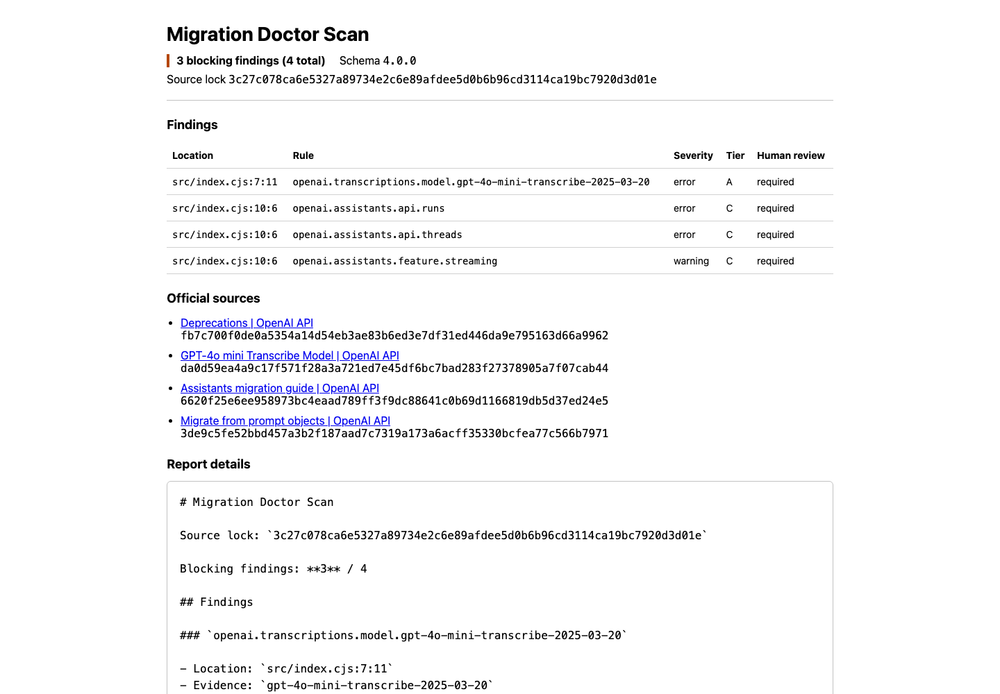

# Five-minute quickstart

This workflow builds the exact locked source tree, scans a repository without changing it, and
saves all four report formats outside the target.

## 1. Install the locked toolchain

Prerequisites are Git, Node.js 20 or later, Corepack, Python 3.9 or later, and uv 0.9.18.

```bash
git clone https://github.com/sujileelea/openai-migration-doctor.git
cd openai-migration-doctor
corepack pnpm install --frozen-lockfile
uv sync --project packages/language-python --locked
corepack pnpm build
```

## 2. Create a report

The output path must not exist and must be outside the target repository. Exit `1` is a completed
report with blocking findings, not a tool failure.

```bash
TARGET=/absolute/path/to/repository
REPORT_PARENT="$(mktemp -d)"

set +e
corepack pnpm run doctor report "$TARGET" \
  --output "$REPORT_PARENT/migration-doctor-report"
STATUS=$?
set -e

test "$STATUS" -eq 0 -o "$STATUS" -eq 1
printf 'Report: %s\n' "$REPORT_PARENT/migration-doctor-report/migration-report.html"
```

The bundle contains Markdown, canonical JSON, SARIF 2.1.0, and script-free static HTML generated
from one normalized scan. No detection path calls an external API.

## 3. Inspect or verify

```bash
corepack pnpm run doctor plan "$TARGET"
corepack pnpm run doctor migrate "$TARGET" --risk safe
corepack pnpm run doctor verify "$TARGET"
```

`migrate` is preview-only. `verify` applies a deterministic Tier A preview only in a temporary copy.
Assistants findings remain Tier C manual actions and never produce a partial patch.

Repository command execution is a separate trusted-code boundary. Supply argv as JSON only when
the repository and command are trusted:

```bash
corepack pnpm run doctor verify-repository "$TARGET" \
  --command '["corepack","pnpm","test"]'
```

This command uses no shell and omits ambient credential variables, but it does not enforce network
or host-filesystem isolation. Its passing result does not set `runtimeBehaviorVerified`.

## Expected output

The checked-in [sample bundle](../examples/sample-report/) was generated from the CommonJS fixture.
It contains one Tier A model finding plus Tier C Threads, Runs, and streaming findings.


